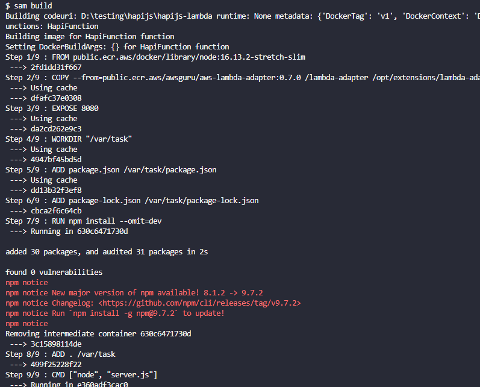
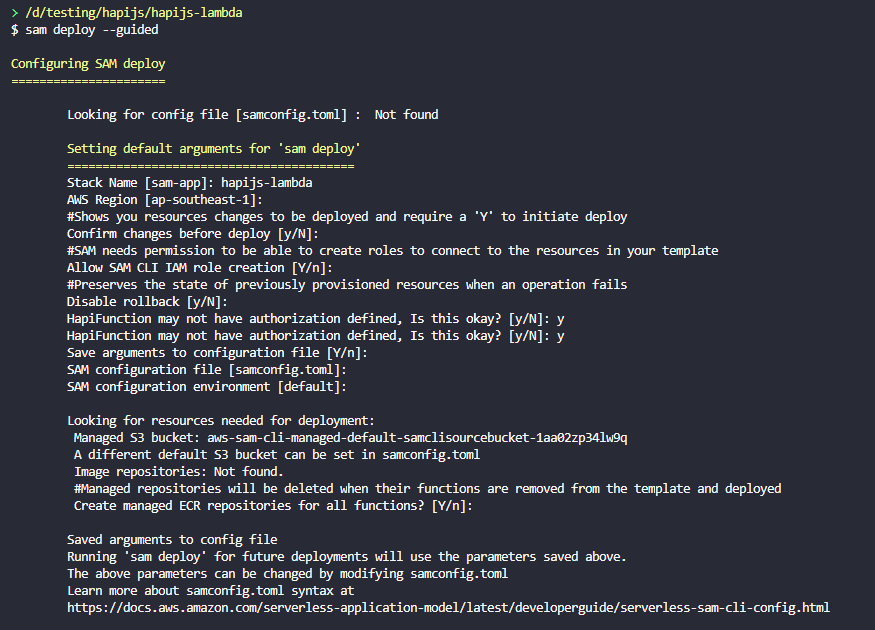
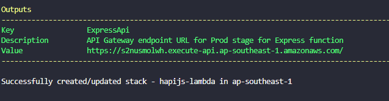
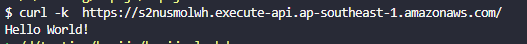

# HapiJS to AWS Lambda

## Prerequisites

1. [Install AWS CLI](https://docs.aws.amazon.com/cli/latest/userguide/getting-started-install.html)
2. [AWS IAM User Access Key and Secret Key](https://docs.aws.amazon.com/powershell/latest/userguide/pstools-appendix-sign-up.html)
3. [Configure AWS CLI](https://docs.aws.amazon.com/cli/latest/userguide/getting-started-quickstart.html)
4. [Install SAM CLI](https://docs.aws.amazon.com/serverless-application-model/latest/developerguide/install-sam-cli.html)

## Deploy HapiJS to Lambda

1. Run SAM Build

```
    sam build
```



2. Then SAM Deploy (for the first time run with --guieded)

```
    sam deploy --guided
```



3. Then get the output url endpoint value
   

4. test end point
   
